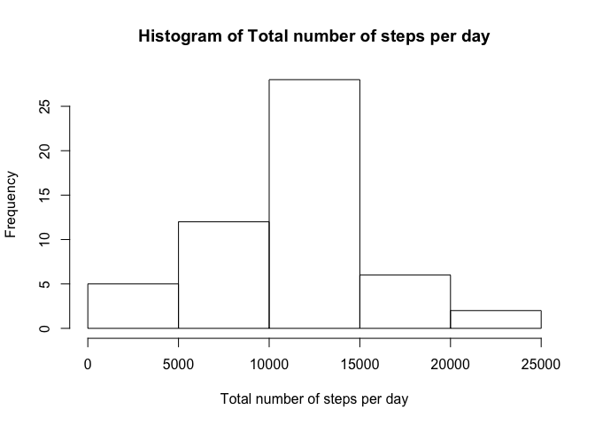
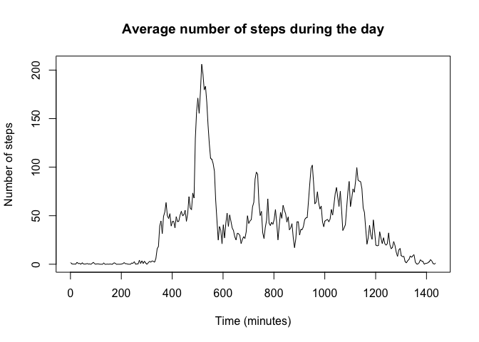
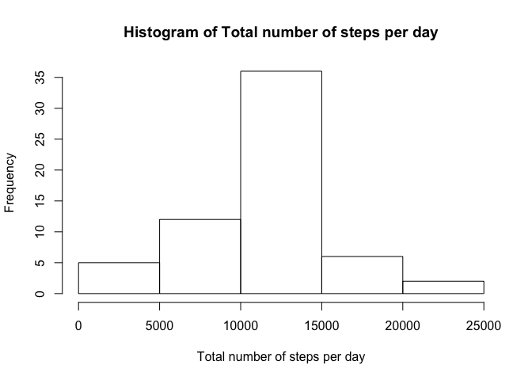
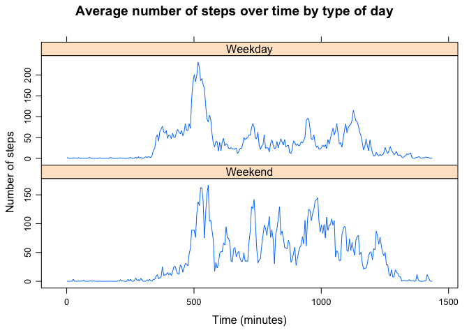

# Reproducible Research: Peer Assessment 1


## Loading and preprocessing the data

First, We'll start by getting the data from the zip file and examining it.

```r
unzip("activity.zip")
raw <- read.csv("activity.csv")
str(raw)
```

```
## 'data.frame':	17568 obs. of  3 variables:
##  $ steps   : int  NA NA NA NA NA NA NA NA NA NA ...
##  $ date    : Factor w/ 61 levels "2012-10-01","2012-10-02",..: 1 1 1 1 1 1 1 1 1 1 ...
##  $ interval: int  0 5 10 15 20 25 30 35 40 45 ...
```

We'll then remove the rows with missing data to simplify calculations in the
first few questions. We'll also remove factor levels which are not in use.

```r
rawComp <- raw[complete.cases(raw),]
rawComp$date <- droplevels(rawComp$date)
```


## What is mean total number of steps taken per day?

```r
sums <- by(rawComp$steps, rawComp$date, sum)
hist(sums,
     main = "Histogram of Total number of steps per day",
     xlab = "Total number of steps per day")
```

<!-- -->

```r
meanSteps <- mean(sums)
medianSteps <- median(sums)
```

The **mean** total number of steps per day is **1.0766189\times 10^{4}**.  
The **median** total number of steps per day is **10765**.


## What is the average daily activity pattern?


```r
means <- by(rawComp$steps, rawComp$interval, mean)
means2 <- cbind(names(means), as.vector(means))

class(means2) <- "numeric"

colnames(means2) <- c("interval", "meanSteps")

activityts <- ts(means2[, 2], frequency = 0.2)
plot(activityts,
     main = "Average number of steps during the day",
     xlab = "Time (minutes)",
     ylab = "Number of steps")
```

<!-- -->

```r
indexMax <- which.max(means2[, 2])
indexMax5 <- 5 * indexMax
intervalMax <- means2[indexMax, 1]
```

The time interval with the highest average of number steps is
**835**, which occurs **520** minutes after midnight.


## Imputing missing values

First, we'll determine the number of missing values in the data.

```r
numOfNAs <- sum(is.na(raw$steps))
```

The number of NA values is **2304**.

Now, we're going to fill in the missing values with the mean number of steps
specific to the interval. Earlier, we created `means2`, which is a matrix containing the mean number of steps matched with the corresponding time interval.

```r
rawMod <- raw

# For every missing value, find the corresponding mean number of steps for that
# particular time interval and use it to replace the NA value.
for (i in 1:nrow(raw)) {
    if (is.na(raw[i, 1] == T))
        rawMod[i, 1] <- means2[means2[, 1] == raw[i, 3], 2]
}

str(rawMod)
```

```
## 'data.frame':	17568 obs. of  3 variables:
##  $ steps   : num  1.717 0.3396 0.1321 0.1509 0.0755 ...
##  $ date    : Factor w/ 61 levels "2012-10-01","2012-10-02",..: 1 1 1 1 1 1 1 1 1 1 ...
##  $ interval: int  0 5 10 15 20 25 30 35 40 45 ...
```

Now we have a modified raw data set `rawMod` where the missing values have been imputed. We'll create a histogram like the one above and we'll calculate the mean and median values for the total number of steps per day.

```r
sums2 <- by(rawMod$steps, rawMod$date, sum)
hist(sums2,
     main = "Histogram of Total number of steps per day",
     xlab = "Total number of steps per day")
```

<!-- -->

```r
meanSteps2 <- mean(sums2)
medianSteps2 <- median(sums2)
```

The **mean** total number of steps per day based on the modified raw data is **1.0766189\times 10^{4}**.  
The **median** total number of steps per day based on the modified raw data is **1.0766189\times 10^{4}**.

The new mean and median happen to be very close to the ones we calculated
before. It's not surprising that the values are close since the imputed values
are based on the rest of the data.

## Are there differences in activity patterns between weekdays and weekends?

First, we're going to create a variable `dayOfWeek` that represents the day of
the week for which the entry was taken. We'll then create a variable `dayType`,
that is set to "Weekday" or "Weekend" based on the value of `dayOfWeek`. We'll
then add `dayType` to the `rawComp` data frame.


```r
dayOfWeek <- weekdays(as.POSIXct(rawMod[, 2]))
dayType <- dayOfWeek
dayType[dayType == "Saturday"] <- "Weekend"
dayType[dayType == "Sunday"] <- "Weekend"
dayType[dayType != "Weekend"] <- "Weekday"
rawMod <- cbind(rawMod, dayType)
```

Now we're going to plot the time series comparing weekday and weekend averages.


```r
library(lattice)

means3 <- by(rawMod$steps, list(rawMod$interval, rawMod$dayType), mean)
means4 <- cbind(means3)

class(means4) <- "numeric"

activityts2 <- ts(means4[, 1:2], frequency = 0.2)
xyplot(activityts2, main = "Average number of steps over time by type of day", xlab = "Time (minutes)", ylab = "Number of steps")
```

<!-- -->


